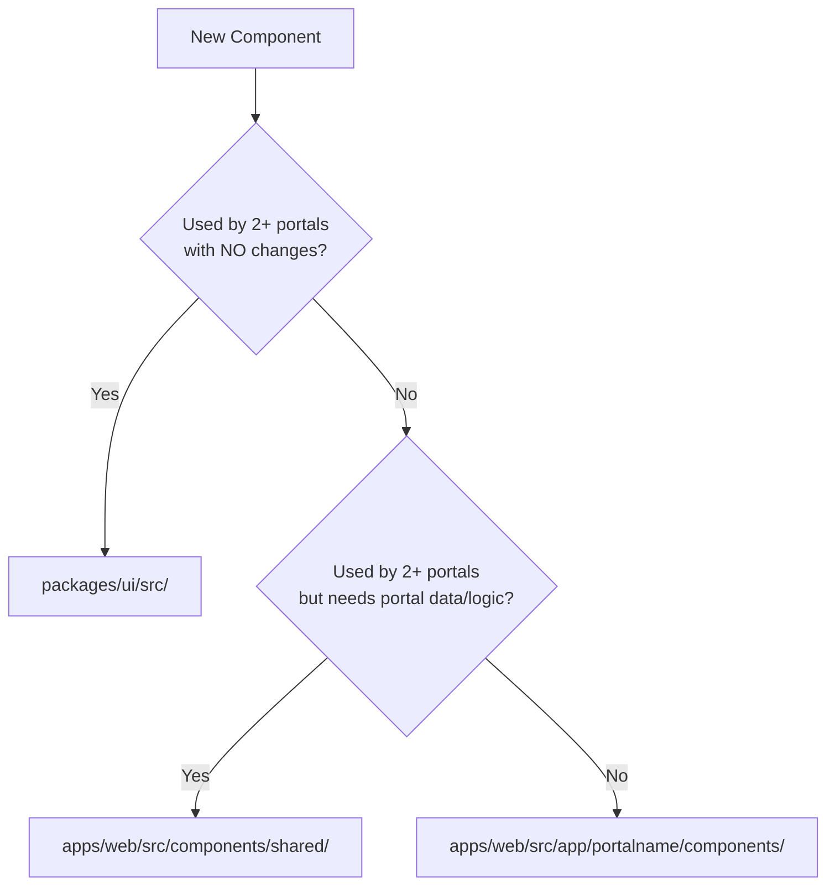

# Component Architecture Plan

## The 3-Tier Decision Framework

Every component falls into exactly one tier. Ask these questions in order:



---

## Tier 1 — `packages/ui/src/` (shared, zero business logic)

This is `@wrapa/ui`. Components here must be pure UI — no API calls, no portal state, no permissions. Split into two sub-folders:

### `packages/ui/src/primitives/` — Atomic building blocks

These are the raw atoms from your old `ui/` folder:

```
packages/ui/src/primitives/
├── arrow-down/
├── date-picker/
├── phone-text-field/
├── timer/
├── empty-state/          ← was empty-table, renamed to be more general
├── icon-tag/
├── image-carousel/
├── pagination/
├── radio/
├── search/
├── tab-panel/
└── unit-input/
```

### `packages/ui/src/modules/` — Composed, multi-part components

These are from your old `modules/` folder — still pure UI, no portal-aware logic:

```
packages/ui/src/modules/
├── animation/
│   └── pulse/
├── card/
├── floating-drawer/
├── modals/
│   ├── change-password/
│   ├── navigation-guard/
│   ├── redirect-confirmation/
│   ├── invite-confirmation/      ← for admin user invites
│   ├── action-confirmation/      ← was restart-confirmation, generic confirm dialog
│   └── user-update/
├── navigation/
│   ├── sidebar/
│   ├── topbar/
│   │   ├── desktop-topbar/
│   │   └── mobile-topbar/
│   ├── bottom-bar/
│   ├── profile-popup/
│   └── types.ts
├── page-loader/
├── password-form/
├── permission/
├── table-action-menu/
├── table-skeleton/
├── timeout-modal/
└── check-list-item/              ← adapted for claim/policy checklists
```

**Rule:** If a module imports from `@wrapa/api-client`, `zustand`, or any portal store — it does NOT belong here. Move it to Tier 2.

---

## Tier 2 — `apps/web/src/components/shared/` (portal-aware, multi-portal)

Components here are wired to real data or portal context but are used by more than one portal. These are NOT exported from `@wrapa/ui`.

```
apps/web/src/components/shared/
├── layouts/
│   ├── auth/               ← used by all portals for login/register flow
│   └── default/            ← the main shell layout (sidebar + topbar + content)
└── pages/
    ├── forgot-password/    ← used by all portals
    ├── login/              ← used by all portals
    ├── reset-password/     ← used by all portals
    ├── invite-accept/      ← used by admin + broker + corporate
    ├── profile/            ← every authenticated portal user has a profile
    ├── user-management/    ← admin + broker + corporate share user management UI
    ├── user-edit/
    └── user-invite/
```

Note: the `pages/` components here are **page-level compositions** (they assemble modules + primitives), imported directly by the route `page.tsx` in each portal.

---

## Tier 3 — `apps/web/src/app/(portal)/components/` (single portal only)

From your old structure, the healthcare-specific components only belong in the HMO portal:

```
apps/web/src/app/(hmo)/components/
├── consultation-list-item/
├── microphone-controls/
├── patient-profile/
├── patient-search/
├── stream-feed/
└── vitals/
```

Each other portal gets its own `components/` folder as needed:

```
apps/web/src/app/(admin)/components/
apps/web/src/app/(broker)/components/
apps/web/src/app/(customer)/components/
apps/web/src/app/(insurer)/components/
apps/web/src/app/(corporate)/components/
apps/web/src/app/(regulator)/components/
```

---

## Summary Table

| Old component                                                                                                                                                           | New location                                                  | Tier |
| ----------------------------------------------------------------------------------------------------------------------------------------------------------------------- | ------------------------------------------------------------- | ---- |
| `ui/*` primitives                                                                                                                                                       | `packages/ui/src/primitives/`                                 | 1    |
| `modules/animation`, `card`, `floating-drawer`, `modals/*`, `navigation/*`, `page-loader`, `password-form`, `permission`, `table-*`, `timeout-modal`, `check-list-item` | `packages/ui/src/modules/`                                    | 1    |
| `layouts/auth`, `layouts/default`                                                                                                                                       | `apps/web/src/components/shared/layouts/`                     | 2    |
| `pages/login`, `forgot-password`, `reset-password`, `invite-accept`, `profile`, `user-management`, `user/edit`, `user/invite`                                           | `apps/web/src/components/shared/pages/`                       | 2    |
| `pages/admin/general`, `pages/dashboard`                                                                                                                                | Each portal's own `(portal)/components/` or direct route page | 3    |
| `consultation-list-item`, `microphone-controls`, `patient-profile`, `patient-search`, `stream-feed`, `vitals`                                                           | `apps/web/src/app/(hmo)/components/`                          | 3    |

---

## Import Convention

```ts
// Tier 1 — from the shared package
import { Pagination, Search } from '@wrapa/ui'
import { ChangePasswordModal, Sidebar } from '@wrapa/ui'

// Tier 2 — relative import inside apps/web
import { DefaultLayout } from '@/components/shared/layouts/default'
import { LoginPage } from '@/components/shared/pages/login'

// Tier 3 — relative import inside the portal
import { PatientSearch } from '../components/patient-search'
```

---

## Implementation Order

1. Set up `packages/ui/src/primitives/` — migrate atomic `ui/` components first (lowest risk)
2. Set up `packages/ui/src/modules/` — migrate pure module components
3. Wire `packages/ui/src/index.ts` to re-export everything
4. Create `apps/web/src/components/shared/` — migrate layouts and shared pages
5. Create per-portal `components/` folders and move portal-specific components in
